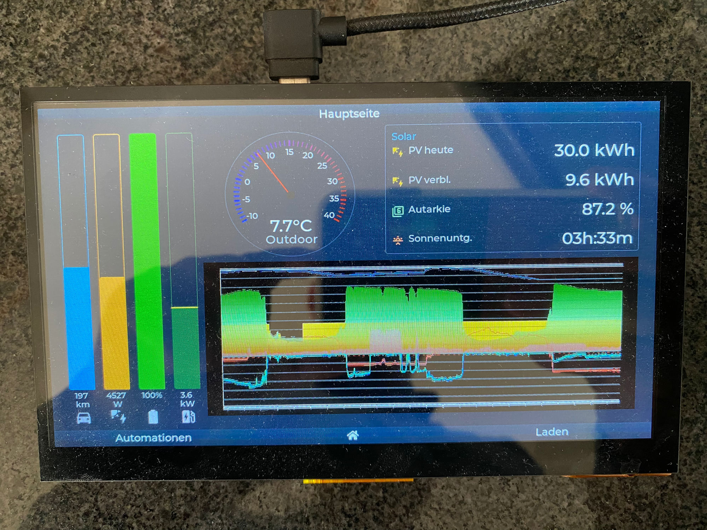

# HA Touch Display

ESPHome configuration for a **Makerfabs MaTouch ESP32-S3 7-inch display** integrated with Home Assistant.



## Hardware

- **MCU:** ESP32-S3, 16 MB Flash, Octal PSRAM, 240 MHz
- **Display:** 1024×600 RGB Parallel Interface
- **Touch:** GT911 capacitive (I2C)
- **Backlight:** LEDC PWM (GPIO10)

## UI Pages

| Page        | Content                                                                 |
| ----------- | ----------------------------------------------------------------------- |
| `main_page` | Thermometer, vertical bars, solar info table, temperature graph         |
| `Licht`     | Office light on/off toggle                                              |
| `Charge`    | EV charging control (PV charging, schedule) + EV info table            |

Navigation via a button matrix at the bottom of the screen (back / home / next).

## Vertical Bar Graphs (left side)

Four vertical bars on the left display live status at a glance:

| Bar   | Color      | Sensor                     | Scale  |
| ----- | ---------- | -------------------------- | ------ |
| 1     | Blue       | EV range (km)              | 400 km |
| 2     | Orange     | PV power                   | 10 kW  |
| 3     | Green      | Home battery SoC           | 100 %  |
| 4     | Dark green | EV charging power          | 11 kW  |

Bar 4 includes a **yellow marker line at 3.6 kW** indicating the single-phase charging threshold — above the line means 3-phase charging is active.

## Temperature Graph

The outdoor temperature history is displayed as a graph on `main_page`. The pipeline:

```
HA Automation (browser_mod) → Python server (port 8765) → ESP32 (online_image)
```

1. **HA Automation** navigates every 15 min to a Lovelace view with an apexcharts-card,
   renders the SVG via JavaScript and POSTs it to the Python server
2. **Python server** (`/opt/graph_server/server.py` on the home server) converts
   SVG → JPEG via cairosvg + Pillow and stores it in RAM
3. **ESP32** fetches the JPEG every 2 min via `online_image` and displays it via an LVGL `image` widget

### Server setup (Linux Mint / Debian)

```bash
sudo apt install python3-cairosvg python3-pil
sudo mkdir -p /opt/graph_server
sudo nano /opt/graph_server/server.py   # paste server code
sudo nano /etc/systemd/system/graph-server.service
sudo systemctl enable --now graph-server
```

### Dependencies

- **browser_mod** (HACS) — for JavaScript execution in the browser
- **apexcharts-card** (HACS) — for the temperature graph

## Home Assistant Integration

- Outdoor temperature sensor
- EV battery range & charging mode (evcc)
- Charging plan status (`evcc_ladeplan_aktiv`)
- Light control via HA action
- Solar sensors: PV today, PV remaining, self-sufficiency, sunset time
- EV sensors: range, charge end, target SoC, departure time, costs, session data
- EV charging power (`sensor.evcc_e_auto_laden_charge_power`)

## Files

- `ha_7zoll_disp.yaml` — complete ESPHome configuration
- `secrets.yaml` — WiFi credentials (not in repo)
- `fonts/` — Material Design Icons TTF

## Build & Flash

```bash
esphome compile ha_7zoll_disp.yaml                                        # compile only
esphome run ha_7zoll_disp.yaml                                            # compile + OTA upload
esphome run ha_7zoll_disp.yaml --device /dev/cu.usbmodem114401            # via USB
esphome logs ha_7zoll_disp.yaml --device 192.168.1.65                     # serial logs (macOS: use IP, not mDNS)
```

## Resources

- [ESPHome LVGL Documentation](https://esphome.io/cookbook/lvgl/)
- [Makerfabs MaTouch ESP32-S3](https://www.makerfabs.com/matouch-esp32-s3.html)
- [Material Design Icons](https://materialdesignicons.com/)
