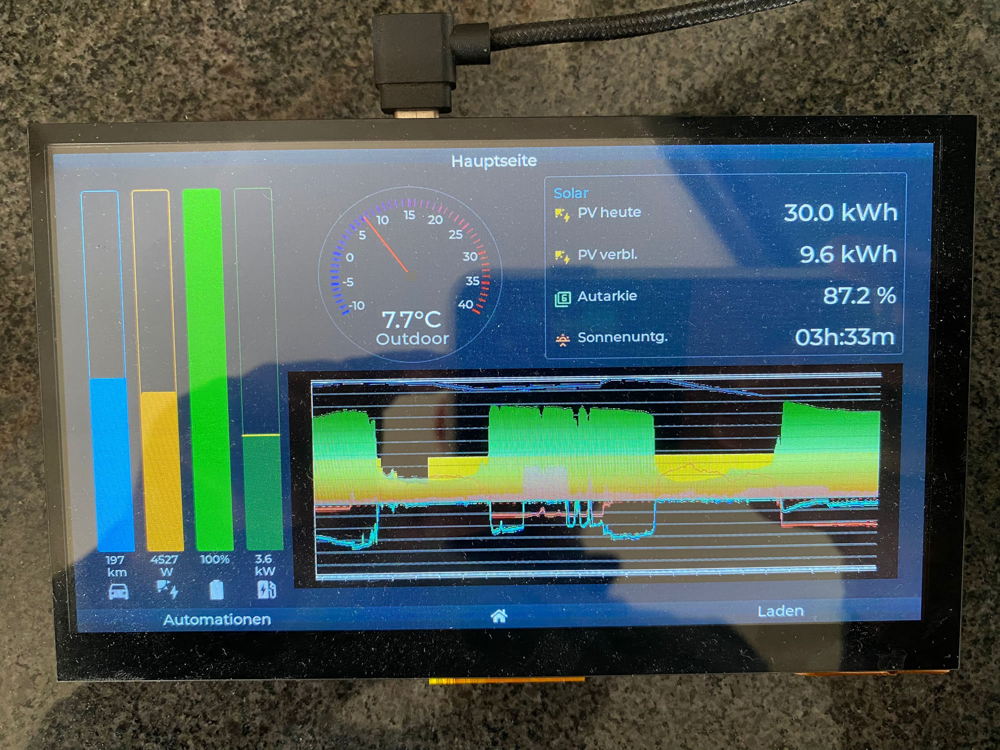
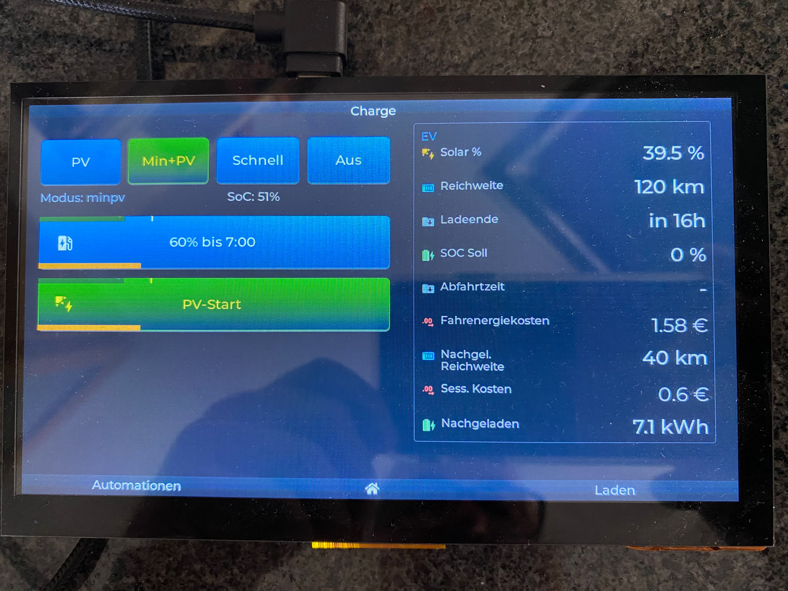

# HA Touch Display

ESPHome configuration for a **Makerfabs MaTouch ESP32-S3 7-inch display** integrated with Home Assistant.



## Hardware

- **MCU:** ESP32-S3, 16 MB Flash, Octal PSRAM, 240 MHz
- **Display:** 1024×600 RGB Parallel Interface
- **Touch:** GT911 capacitive (I2C)
- **Backlight:** LEDC PWM (GPIO10)

## UI Pages

| Page        | Content                                                                 |
| ----------- | ----------------------------------------------------------------------- |
| `main_page` | Thermometer, vertical bars, solar info table, temperature graph         |
| `Licht`     | Office light on/off toggle                                              |
| `Charge`    | EV charging controls (mode buttons, PV-Start, schedule) + EV info table |

Navigation via a button matrix at the bottom of the screen (Automationen / home / Laden) — each button navigates directly to the target page.

## Charge Page



The Charge page provides full EV charging control:

- **4 Mode buttons** (PV / Min+PV / Schnell / Aus) — set evcc charging mode via `script.evcc_lademodus`
- **Active mode** is highlighted green automatically via the `select.evcc_e_auto_laden_mode` entity
- **Ladeplan button** (60% bis 7:00) — creates/deletes a charging plan
- **PV-Start button** — activates MinPV charging with battery limits via `script.evcc_minpv_aktivieren`, highlighted green when mode is `minpv`
- Both large buttons show **horizontal fill bars**: charge power (top, dark green, 3.6 kW marker) and range (bottom, orange)

## Vertical Bar Graphs (left side)

Four vertical bars on the left display live status at a glance:

| Bar   | Color      | Sensor                     | Scale  |
| ----- | ---------- | -------------------------- | ------ |
| 1     | Blue       | EV range (km)              | 400 km |
| 2     | Orange     | PV power                   | 10 kW  |
| 3     | Green      | Home battery SoC           | 100 %  |
| 4     | Dark green | EV charging power          | 11 kW  |

Bar 4 includes a **yellow marker line at 3.6 kW** indicating the single-phase charging threshold — above the line means 3-phase charging is active.

## Solar Energy Graph

The solar energy flows (PV production, consumption, battery, grid) are displayed as a graph on `main_page`. The pipeline:

```
HA Automation (browser_mod) → Python server (port 8765) → ESP32 (online_image)
```

1. **HA Automation** navigates every 15 min to a Lovelace view with an apexcharts-card,
   renders the SVG via JavaScript and POSTs it to the Python server
2. **Python server** (`/opt/graph_server/server.py` on the home server):
   - Resolves CSS custom properties (`var(--primary-text-color)` → `#ffffff`)
   - Bumps `apexcharts-text` font-size 3× so axis labels stay legible after downscaling
   - Strips `<foreignObject>` (legend HTML, not needed)
   - Renders via **`rsvg-convert`** (librsvg) at 2× target resolution. CairoSVG was previously used but rendered `fill="#ffffff"` as green on `.apexcharts-text` elements — librsvg renders correctly
   - Downsamples 2× via PIL `Image.BOX` filter (no LANCZOS ringing on 1-px strokes)
   - JPEG quality 95, `subsampling=0` (4:4:4) against chroma artifacts on saturated gradients
3. **ESP32** fetches the JPEG via `online_image` and displays it via an LVGL `image` widget

The server emits two endpoints:

- `/temp_graph.jpg` — 729×275, used by the MAtouch display, viewBox expanded 10% to the right (legacy axis-clip workaround)
- `/temp_graph_580.jpg` — 580×185, used by the Waveshare ESP32-S3-Touch-LCD-7 display (smaller decode buffer, no viewBox hack)
- `/temp_graph_580.png`, `/raw.svg`, `/processed.svg` — debug endpoints

### Server setup (Linux Mint / Debian)

```bash
sudo apt install python3-pil librsvg2-bin
sudo mkdir -p /opt/graph_server
sudo nano /opt/graph_server/server.py   # paste server code
sudo nano /etc/systemd/system/graph-server.service
sudo systemctl enable --now graph-server
```

### Dependencies

- **browser_mod** (HACS) — for JavaScript execution in the browser
- **apexcharts-card** (HACS) — for the temperature graph

## Home Assistant Integration

- Outdoor temperature sensor
- EV battery range & charging mode (evcc)
- Charging plan status (`evcc_ladeplan_aktiv`)
- Light control via HA action
- Solar sensors: PV today, PV remaining, self-sufficiency, sunset time
- EV sensors: range, charge end, target SoC, departure time, costs, session data
- EV charging power (`sensor.evcc_e_auto_laden_charge_power`)

## Files

- `ha_7zoll_disp.yaml` — complete ESPHome configuration
- `secrets.yaml` — WiFi credentials (not in repo)
- `fonts/` — Material Design Icons TTF

## Build & Flash

```bash
esphome compile ha_7zoll_disp.yaml                                        # compile only
esphome run ha_7zoll_disp.yaml                                            # compile + OTA upload
esphome run ha_7zoll_disp.yaml --device /dev/cu.usbmodem14401             # via USB
esphome logs ha_7zoll_disp.yaml --device 192.168.1.65                     # serial logs (macOS: use IP, not mDNS)
```

## Resources

- [ESPHome LVGL Documentation](https://esphome.io/cookbook/lvgl/)
- [Makerfabs MaTouch ESP32-S3](https://www.makerfabs.com/matouch-esp32-s3.html)
- [Material Design Icons](https://materialdesignicons.com/)
